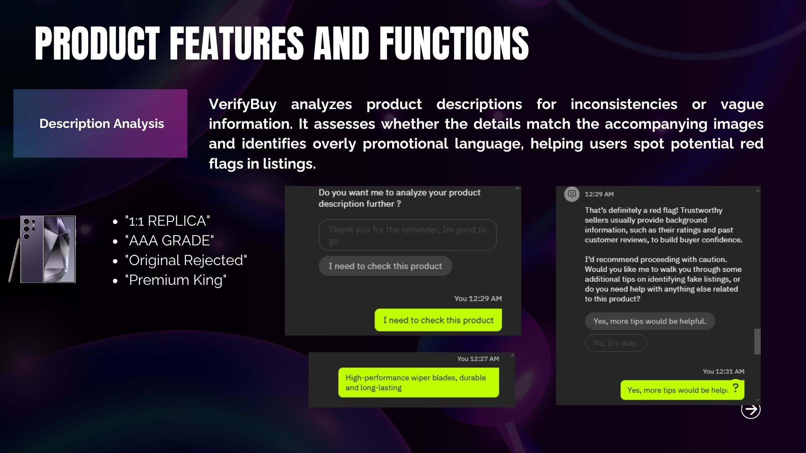
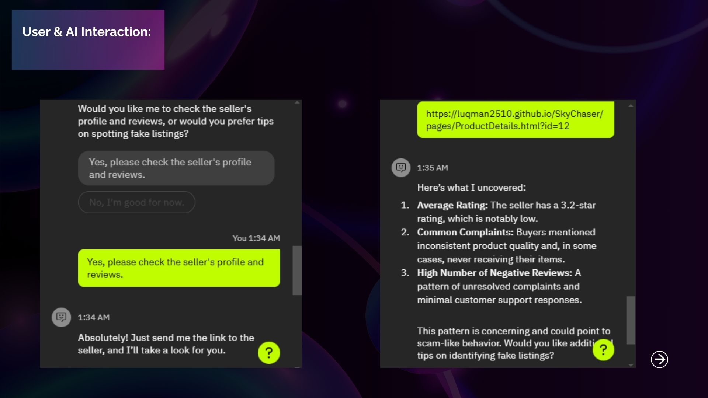

# IBM_Hackathon_2024

🧠 Group Name: SkyChaser

🥈 Awarded 4th place

👨‍💻 Built in collaboration with 3 teammates using IBM Watsonx AI
  
## 👥 Team Members
| Name                               
| ---------------------------------- 
| Nurul Izzatty
| Wan Muhammad Luqman                   
| Muhammad Amir     

## 🛠️ Tech Stack

- IBM watsonx.ai (Model training, API integration)
-  HTML5
- CSS3
- JavaScript
- Bootstrap
- Git & GitHub

## ✨ Features
- 🚀 Interactive space-themed UI
- 🌌 Responsive design using Bootstrap
- 🎮 Clickable animated objects and effects

## 📂 Project Structure

```bash
IBM_Hackathon/
│
├── index.html
│
├── style.css
│
├── script.js
│
├── images/                             
│   ├── 8.png
│   ├── 11.png
│   ├── 12.png
│   └── 15.png
│
├── README.md
└── .gitignore

## 🌐 Website Preview

### Page 1


### Page 2


### Page 3


### Page 4


## 🧠 What I Learned

- How to build and deploy AI-powered features using IBM watsonx.ai
- Integrating IBM cloud-based AI models into a web application
- Team collaboration in a fast-paced hackathon environment
